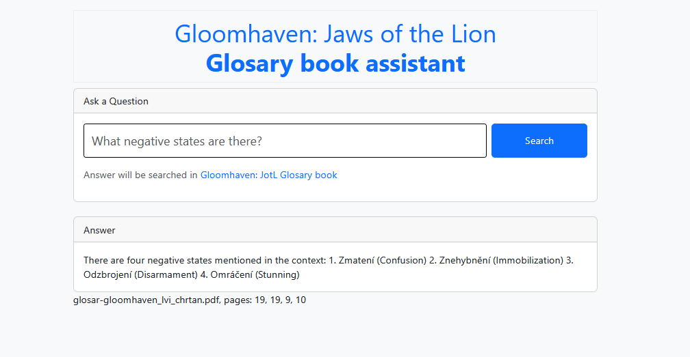

# gloomhaven_chat

In this toy project I'm utilizing things I've learned to create an **LLM-powered app** that is capable **to answer questions based on Gloomhaven: Jaws of the Lion Glosary book**.

**Technology**

- LangChain
- Flask

**Steps to reproduce**

- Create a `venv` using the `requirements.txt` file attached.
- Download the Gloomhaven: Jaws of the Lion Glosary book (e.g., [this](https://www.zatrolene-hry.cz/spolecenska-hra/gloomhaven-lvi-chrtan-10327/k-stazeni/glosar-12276/) Czech one from [Zatrolené hry](https://zatrolene-hry.cz))
- Create `.env` file that contains 
    - `OPENAI_API_KEY`
    - `LLM_MODEL`="gpt-3.5-turbo"
    - `ROOT_DIR` - where to look for all necessary files
    - `DOCUMENT_PATH` - Glosary book filepath (relative to ROOT_DIR)
- Run the app from CMD
    - `export FLASK_APP=chat_gloomhaven.py`
    - `export FLASK_ENV=development`
    - `flask run`

**Example**

